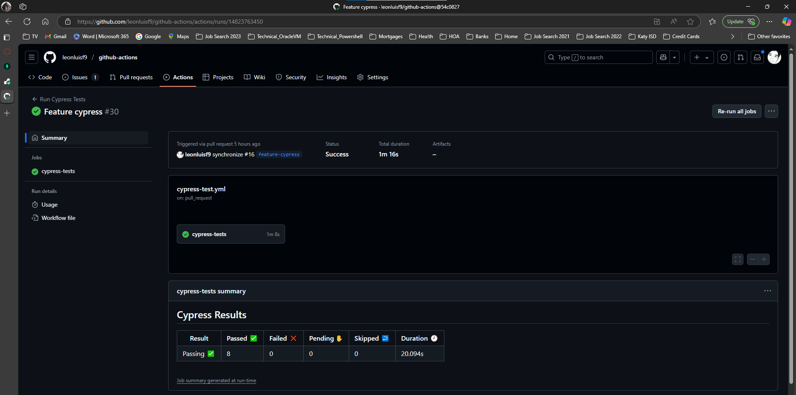
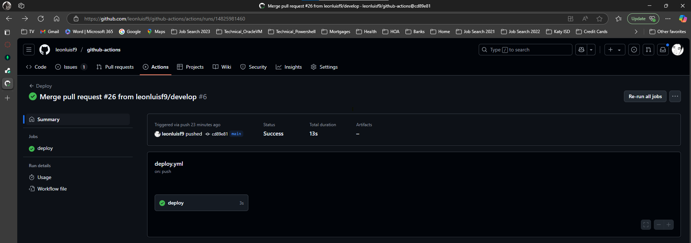

# GitHub Actions CI/CD Setup

## Table of Contents
1. [Description](#description)
2. [Installation](#installation)
3. [Usage](#usage)
4. [Screenshots](#Screenshots)
5. [Link](#Deployed-App-Link)
6. [License](#license)
7. [Questions](#questions)

## Description
CI/CD pipeline using GitHub Actions to run the component tests via Cypress when a Pull Request is made to the develop branch, and the application is deployed when code is merged from develop to the main branch.
## Installation
Clone the repository: https://github.com/leonluisf9/github-actions Navigate to the project directory: Install dependencies: Setup MongoDB and Environment variables then Start Backend npm start build and Frontend npm run client:build and client:dev Open the App Visit http://localhost:3001/ in your browser
## Usage
Use Client Front End to Start Quiz, answer questions and click next button until the End where you will get your score. If a Pull Request is submitted to a develop branch A GitHub Action must trigger and the Action must execute the Cypress component tests. All Cypress component tests must pass. When a Pull Request is submitted and merged to the main branch A GitHub Action must trigger and the Action must automatically deploy the application to Render.
## Screenshots
GitHub Actions for tests

GitHub Actions for deployments

## Deployed-App-Link
https://github-actions-h2gh.onrender.com
## License
Please visit http://choosealicense.com/licenses/mit/ to get information for this license
## Questions
You can find me [HERE](https://github.com/leonlewisf) on Github
You can email me at leonlewisf@outlook.com if you have any additional questions.
